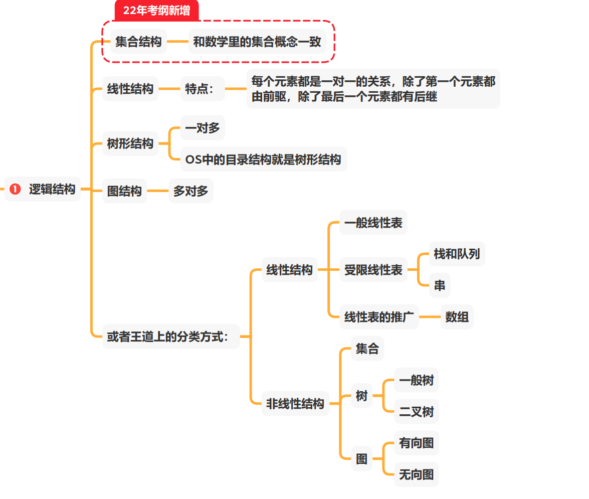
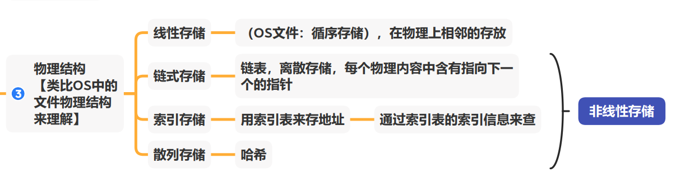
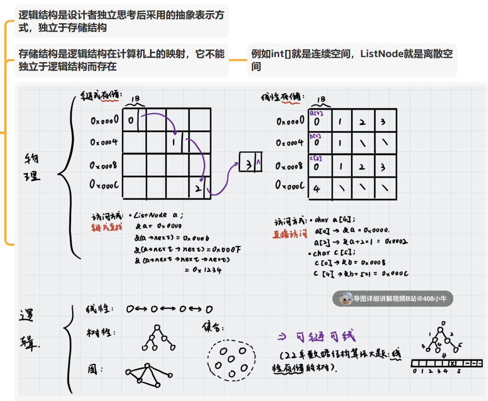
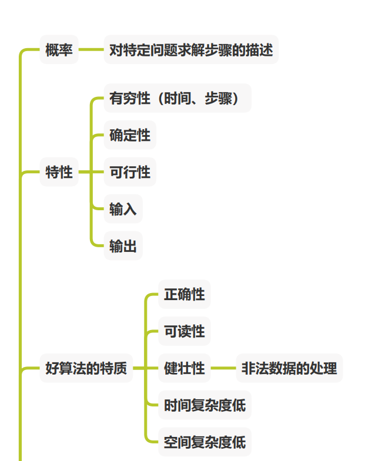
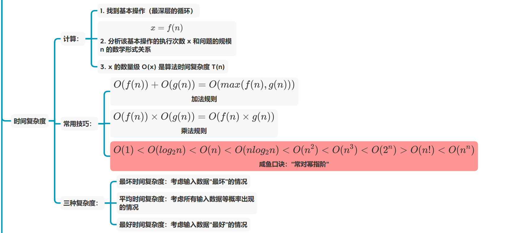
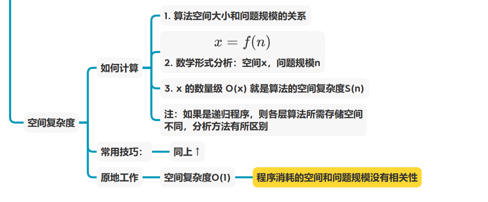

## 1、绪论

### 1.1 数据结构的基本概念

数据是信息的载体，数据元素是数据的基本单位，数据对象是具有相同性质的数据元素的集合

数据类型是一个值得集合以及定义在该集合上的一组操作的总称。可以分为1.原子类型（不可再分）2.结构类型（可进一步分解为若干分量）3.抽象数据类型（ADT）：是对数据的某种抽象，规定了数据的取值范围，结构形式以及可执行的操作集合。

数据结构是相互之间存在一种或多种特定关系的数据元素的集合，其包含三方面的内容：逻辑结构、存储结构、数据的运算

### 1.2 数据结构三要素

1.数据的逻辑结构

数据元素之间的逻辑关系，下图为其分类

2.数据的存储结构

3.数据的运算

物理与逻辑的关系

### 1.3 算法与算法评价

1.算法的概念以及特点

如下图：

2.时间复杂度和空间复杂度的计算

时间复杂度（重点）

空间复杂度
